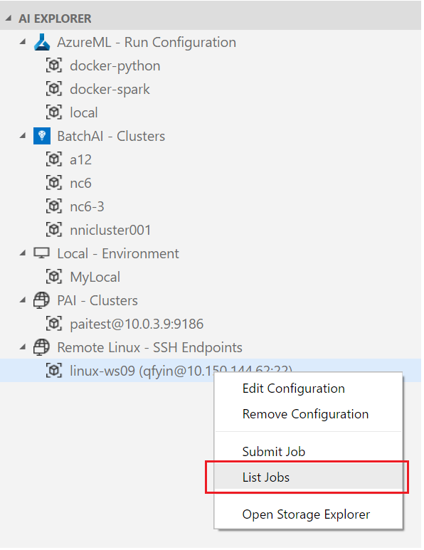
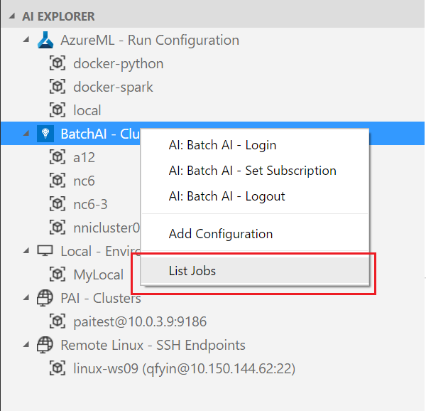
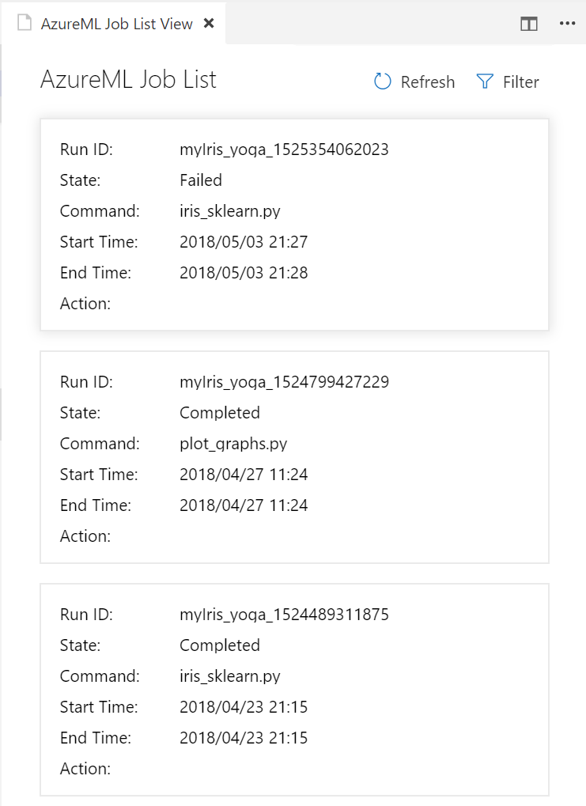
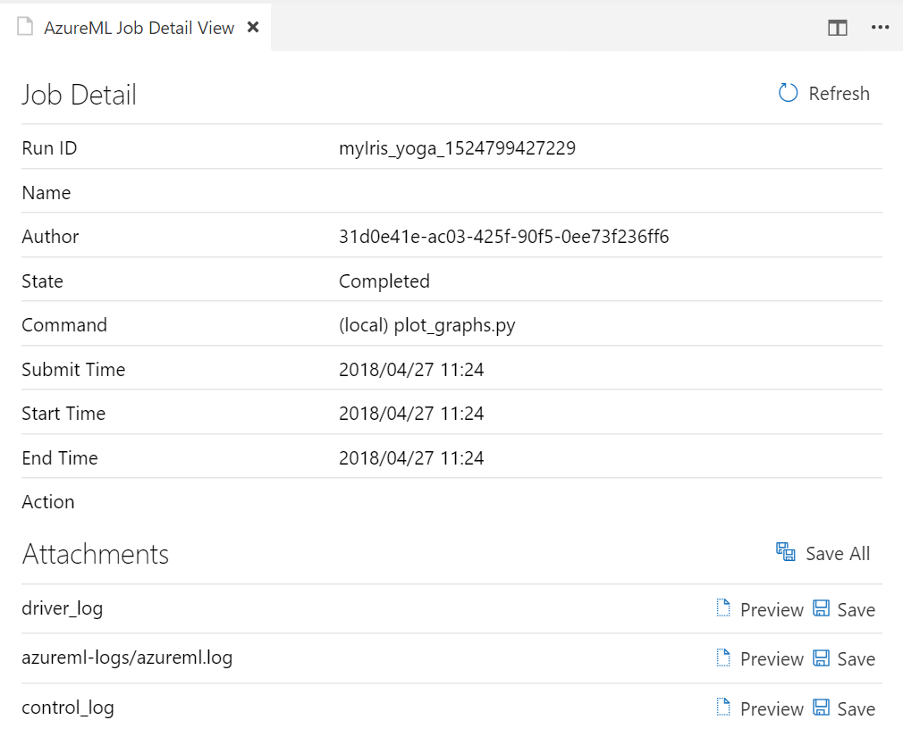

# View recent job performance and details

Once the jobs are submitted, you can list the jobs from the run history.
VS Code Tools for AI provides two ways to list job:

* From Command Palette
    1. Open the command palette (View > **Command Palette** or **Ctrl+Shift+P**).
    2. Enter "**AI List**."
    3. You get a recommendation for "AI: List Jobs", select and press enter.
    4. Select the platform which you want to check.

* From AI Explorer
    1. Expand the **AI Explorer"
    2. Right click a proper node and click ***List Jobs*** in the context menu

    > [!TIP]
    > Because of different underlying mechanisms of run history management, the context menu varies according to the node you chose.
    > For **Azure ML**, choose the platform node to see ***List Jobs***. 
    > For **PAI** and **Remote Linux**, choose the compute target node. Please refer to below screenshot pictures.
    > Similarly, if you execute the command from Command Palette, there is an extra step for **PAI** and **Remote Linux** to select a configuration (compute target).

     

The Job List View opens and displays all the runs and some related information.
The job history is displayed either in a table view or in a card view depends on the window size.

  

To view the results of a job, click on the **job ID** link (or the card) to see detailed information. 
In the Job Detail View, you can preview the run log within VS Code or download them to local disk.

