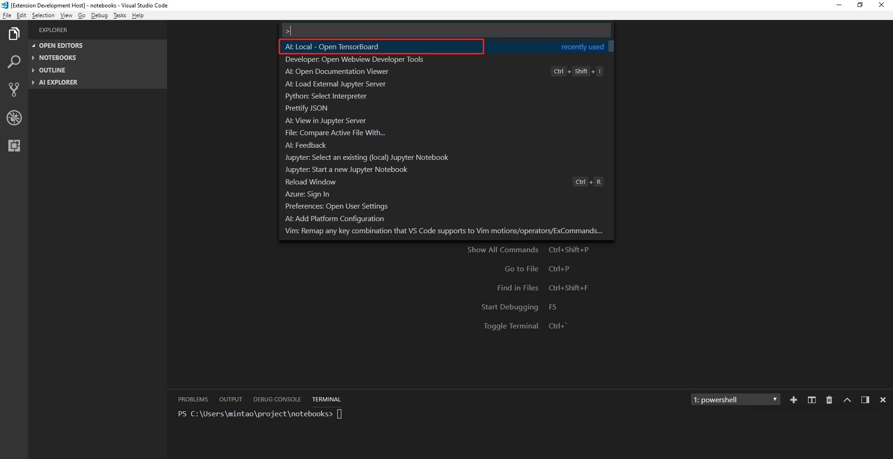
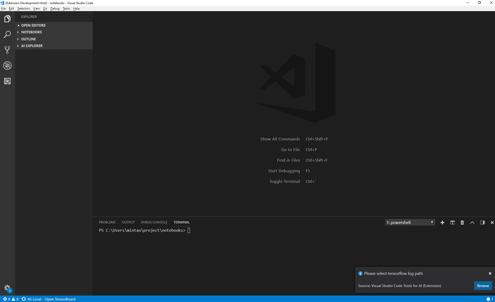
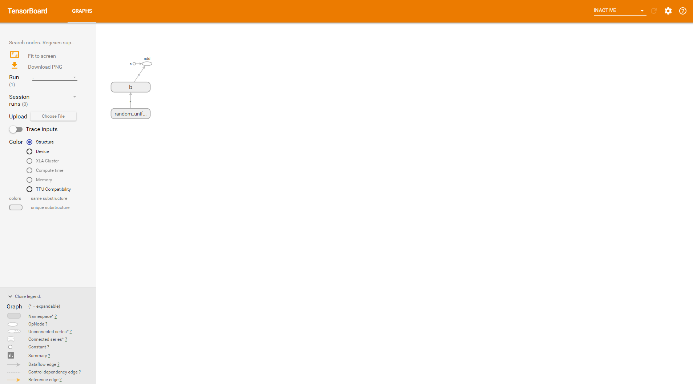

# Run TensorBoard locally in VS Code

In this quickstart, we will run a tensorboard service locally in AI Tools and view the model graph. 

## Prerequisites

Before you begin, ensure you [set Python path properly in VS Code properly](https://code.visualstudio.com/docs/python/environments) and have already installed following packages in Python:

### Google TensorFlow 

Install tensorflow in the python path with pip

```cmd
pip install tensorflow
```

or if you have an Nvidia GPU

```cmd
pip install tensorflow-gpu
```

For more info, please refer to [official TensorFlow doc](https://www.tensorflow.org/install/). The TensorBoard is contained in TensorFlow package, so you don't need to install TensorBoard seperately.

### Write the log data when you training a TensorFlow job.

Use ```tf.summary``` module to collect data from your training job. Here is [an example project](https://github.com/tensorflow/tensorflow/blob/r1.10/tensorflow/examples/tutorials/mnist/mnist_with_summaries.py) from TensorBoard official guide.


## Select the log directory and start TensorBoard from VS Code command palette. 

- Open command palette from VS Code by pressing Ctrl+Shift+P.

- Select **"AI: Local - Run TensorBoard"** command



- A message window will pop up for selecting the log directory created by training job.



- After selecting the log directory, a TensorBoard server will start in the VS Code terminal and represent the model graph in an external browser. 

